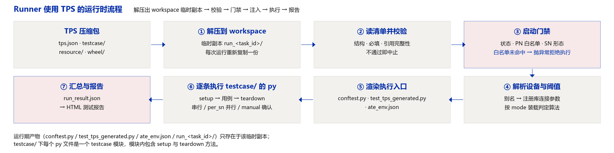
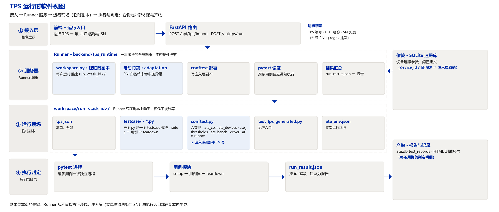
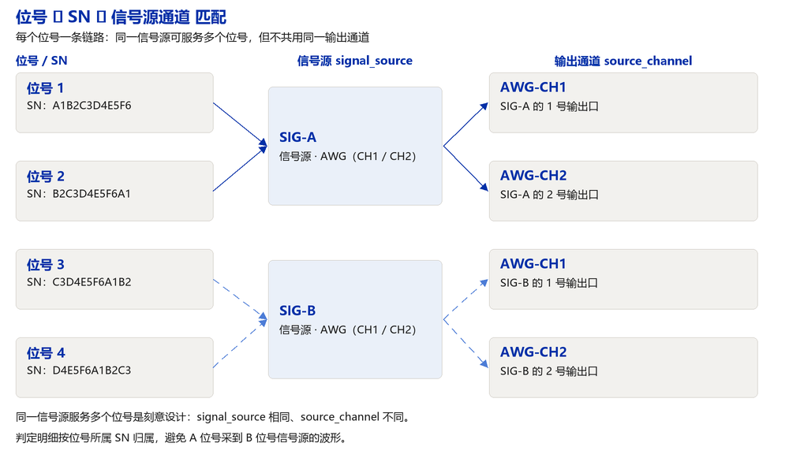

# uut.json 文件结构与设计

> 本文描述 TPS 清单（`uut.json`，现网文件名 `tps.json`，两者指同一份清单）的文件结构、字段职责与执行流程。
> 清单是受控数据，用例实现是代码；两者通过条目的 `case` 字段一一对应。

## 一、设计意图

本方案把测试用例集从执行代码中剥离为一份受控数据，用以解决三个问题：测试内容散落在代码里、无法评审；同一台装备在不同台架上的判定口径不一致；更换台架必须改动用例实现。

据此确定四条设计约束。

| 约束 | 含义 |
| --- | --- |
| 清单只声明，不实现 | 清单内不出现执行代码、连接参数、调用实参；测试动作全部由 `testcase/` 中的 Python 函数实现 |
| 单一事实源 | 用例顺序只写在 `cmd_suit`，判定算法与阈值只写在 `threshold`，设备引用只写在 `device`，被测对象适配范围只写在 `adaptation`；同一信息只允许出现一次 |
| 引用而非复制 | 清单只写设备别名与注册库编号，IP、端口、串口、波特率由执行器在运行时从注册库查询 |
| 判定集中 | 通过/不通过只由用例调用判定接口产生，清单不承载判定表达式 |

清单的边界：不描述夹具接线细节，不承载测试向量数据。这类内容以配置文件形式放在包内 `resource/`，由用例按包内路径读取。

## 二、TPS 包结构

一个 TPS 就是一个目录，打包后即为压缩包。

```text
spm_rh_dyn/                         ← TPS 包（打包后即压缩包）
├── tps.json                        ← 清单：五键
├── testcase/                       ← 每个 py 文件是一个 testcase 模块
│   ├── __init__.py                 必备
│   ├── env_setup.py                含 setup / teardown 方法
│   ├── power.py                    含 setup / teardown 方法
│   └── comm.py
├── resource/                       清单之外的配置与数据
│   ├── pn_whitelist.json
│   ├── channel_map.json
│   ├── fixture_list.json
│   ├── appearance_check.md         manual 弹窗文案（按条目 resource 名取）
│   └── appearance_check.png        同名图片，与文案一并展示
└── wheel/                          其余 Python 驱动
    ├── scope_sdk-1.2.0-py3-none-any.whl
    └── dmm_driver-0.9.3-py3-none-any.whl
```

各子目录 / 文件的结构与作用：

| 子目录 / 文件 | 结构 | 作用 |
| --- | --- | --- |
| `tps.json` | 单个 JSON 文件，五键 | 清单：声明跑什么、按什么顺序、按什么判 |
| `testcase/` | Python 包，必须含 `__init__.py`，一个 py 文件一个 testcase 模块，模块内含 `setup` 与 `teardown` 方法 | 用例实现：清单条目 `case` 字段引用的目标函数 |
| `resource/` | 配置文件目录，JSON / CSV / YAML / Markdown / 图片均可 | 存放清单之外的配置与数据：大批量 PN 白名单、通道表、夹具清单、测试向量；`manual` 条目的弹窗文案与图片也在这里，由用例按名称取 |
| `wheel/` | `.whl` 文件 | 存放其余 Python 驱动与设备 SDK，随包分发，供离线工控机安装或直接加载 |
| 运行期产物 | 不在包内 | `conftest.py`、`test_tps_generated.py`、`ate_env.json`、`run_<task_id>/` 由执行器在运行目录生成 |

交付约定：导入接口接收单个 JSON 清单文本，后端将其落成 `testresource/<id>/tps.json`；`testcase/`、`resource/`、`wheel/` 三个目录随后整体拷入同一 TPS 目录。

### 2.1 运行时副本

Runner 不在源包上直接执行。每次运行它都在 workspace 下建一个临时副本，把 TPS 内容整体复制进去，之后的校验、注入与执行都发生在副本里。

| 环节 | 行为 |
| --- | --- |
| 建副本 | `<workspace>/<tps 目录名>/run_<task_id>/`；同名目录先清掉再整体复制源目录 |
| 执行对象 | 副本，不是源包——源包改动后下一次运行立即生效，多次运行之间互不污染 |
| 副本内产物 | `conftest.py`（公共注入层副本）、`test_tps_generated.py`（执行入口）、`ate_env.json`（本次运行环境） |
| 清理 | 按 `keep_runs` 保留最近若干次运行，其余自动清理 |



## 三、TPS 的使用方法（Runner 与 conftest）

清单本身不可执行。它由两侧消费：后端执行器（Runner）负责读取、校验与编排，`conftest.py` 负责向用例注入所需的一切。



**Runner（后端执行器）**

| 步骤 | 动作 | 依赖字段 |
| --- | --- | --- |
| 0 | 在 workspace 下建临时副本 `run_<task_id>/`，把 TPS 内容整体复制进去 | — |
| 1 | 在副本内载入 `tps.json`，校验结构：schema、必填项、引用完整性 | 全量 |
| 2 | 启动门禁：状态是否允许生产、件号是否在白名单内、SN 形态是否匹配 | `metadata.status` / `adaptation.part_number` / `adaptation.sn` |
| 3 | 解析设备与阈值：别名 → 注册库记录 → 连接参数；阈值键 → 算法与参数 | `device` / `threshold` |
| 4 | 按 `cmd_suit` 三段顺序展开执行序列，渲染执行入口与环境描述 | `cmd_suit` / `setup` / `teardown` |
| 5 | 逐条用例以独立 pytest 进程执行，收集判定明细；`manual` 条目弹窗等操作员选 next / abort | 条目的 `type` / `resource` / `parallel` / `exec.timeout_s` |
| 6 | 汇总 `run_result.json`，生成 HTML 报告 | `metadata` / `threshold` |

**conftest（注入通道）**

| 夹具 | 注入内容 | 来源 |
| --- | --- | --- |
| `ate_ctx` | 判定上下文：`expect(key, value, label)`、步骤状态回传、人工确认提示 | `threshold` + 运行时登记 |
| `ate_devices` | `别名 → 设备实例`，连接参数已就绪 | `device` + 注册库 |
| `ate_thresholds` | 阈值键 → 判定算法与参数 | `threshold` |
| `ate_bench` | 台架信息：编号、类型、BOM 摘要 | 运行环境 |
| `driver` | 设备驱动工厂：示波器、电源、DMM 等按型号构造 | `wheel/` + 注册库 |
| `ate_runner` | 当前用例在序列中的位置与状态 | `cmd_suit` |

用例侧只声明需要哪些夹具，取值与判定口径都由注入层提供：

```python
def test_vdd(ate_ctx, ate_devices):
    dmm = ate_devices["dmm"]
    ate_ctx.expect("TC_VDD", dmm.read_voltage())   # 判定口径来自 threshold
```

用例不读清单文件、不连设备、不判断阈值。

## 四、执行流程

清单的五个键按固定顺序被消费，形成一条从启动到报告的流程：

| 阶段 | 消费字段 | 动作 | 产物 |
| --- | --- | --- | --- |
| ① 载入与校验 | 全量 | 结构校验与引用完整性检查 | 校验结果；不通过即中止 |
| ② 启动门禁 | `metadata.status` / `adaptation.part_number.whitelist` / `adaptation.sn.regex` | 状态是否允许生产、件号是否在白名单、SN 形态是否匹配 | 通过；件号未命中白名单或 SN 形态不符时直接抛异常，流程中止 |
| ③ 位号绑定 | `adaptation.channels` | 每个位号的 SN 绑定信号源与物理通道 | 通道映射表，后续数据按此归属 |
| ④ 设备解析 | `device` | 别名 → 注册库 → 连接参数 → 设备实例 | `ate_devices` 夹具 |
| ⑤ 阈值装载 | `threshold` | 按 `mode` 装载判定算法与参数 | `ate_thresholds` 夹具 |
| ⑥ 序列展开 | `cmd_suit` / `setup` / `teardown` | 三段按书写顺序展开；`per_sn` 条目逐位号展开，`manual` 条目插入等待点（next / abort） | 执行序列与执行入口 |
| ⑦ 执行与判定 | 条目的 `exec`、阈值算法 | 每条用例独立进程执行，判定按算法取样本算值 | 判定明细、`run_result.json` |
| ⑧ 收尾与报告 | `teardown` / `metadata` | 安全收尾必跑，汇总结果 | HTML 报告、运行记录 |

## 五、metadata · 版本数据

记录这份基线是什么版本、谁定的、什么时候定的，是评审与追溯的落点，不参与执行。

| 字段 | 类型 | 必需 | 作用 |
| --- | --- | --- | --- |
| `version` | string | 是 | 基线版本号，报告据此追溯判据版本 |
| `status` | string | 是 | `draft` / `review` / `released`；只有 `released` 允许用于正式生产运行 |
| `author` | string | 是 | 责任人，判据谁定的 |
| `created_at` | string | 是 | 基线建立日期（`YYYY-MM-DD`） |
| `id` | string | 是 | 基线编号，运行、报告、记录引用它的稳定键 |
| `name` | string | 是 | 基线名称，报告标题与列表展示用 |
| `applies_to` | string | 是 | 适用台架类型编号 |

## 六、adaptation · PN 白名单与多路 SN 信号源匹配

这一键回答两个问题：这台 UUT 能不能用这份基线测；多个 SN 并行时，每个 SN 采到的数据属于哪个信号源。

### 6.1 PN 白名单机制

件号从 UUT 名称中按正则提取，再与白名单逐项比对；不在白名单内即**直接抛异常，拒绝执行**。白名单是"这份基线适配哪些件号"的唯一声明处。

```text
UUT 名称 / 登记信息
        │  part_number.regex 提取
        ▼
      件号 PN ──── 与 part_number.whitelist 比对 ────┬── 命中 ──→ 通过，继续执行
                                                     └── 未命中 → 抛异常，拒绝执行
```

| 字段 | 作用 |
| --- | --- |
| `part_number.regex` | 从 UUT 名称中提取件号的正则（命名组 `pn`） |
| `part_number.whitelist` | 件号白名单；命中才允许执行，未命中直接抛异常 |
| `part_number.whitelist_file` | 可选：白名单文件相对路径（如 `resource/pn_whitelist.json`），用于件号数量大、需独立维护的场景；与内联白名单合并生效 |

白名单规模小时直接内联在清单里便于评审；件号成百上千时放 `resource/`，清单只留引用。

### 6.2 多路 SN 匹配信号源

`channels` 声明并行路数与"位号 → 信号源"的对应关系。几个 SN 同时测试时，每个位号的采集通道各接在一个信号源上；这层关系不显式声明，就会出现**数据串位**——A 位号采到 B 位号信号源的波形，报告把 A 判成合格或不合格。

| 字段 | 作用 |
| --- | --- |
| `count` | 并行路数 |
| `slots[].slot` | 位号（1..count），对应台架上第几个 SN 位 |
| `slots[].signal_source` | 该位号 SN 采集数据所对应的信号源标识；判定与记录据此把数据归到正确的 SN |
| `slots[].source_channel` | 信号源上的物理输出通道，保证位号之间不落到同一个输出口 |
| `slots[].fixture` | 可选：该位号使用的夹具编号 |

示例（4 路并行，两个信号源各带两个通道）：

| 位号 | 信号源 | 输出通道 |
| --- | --- | --- |
| 1 | `SIG-A` | `AWG-CH1` |
| 2 | `SIG-A` | `AWG-CH2` |
| 3 | `SIG-B` | `AWG-CH1` |
| 4 | `SIG-B` | `AWG-CH2` |



同一信号源被多个位号共用是刻意设计：`signal_source` 相同、`source_channel` 不同，一眼可辨。

### 6.3 SN 形态

| 字段 | 作用 |
| --- | --- |
| `sn.regex` | SN 形态正则（12 位英数），形态不符即抛异常，拒绝执行 |
| `sn.note` | 可选：形态说明，供人阅读 |

## 七、device · 设备信息

这一键声明"用例需要哪些设备"，只写引用，不写连接参数。

| 字段 | 必需 | 作用 |
| --- | --- | --- |
| 别名（键） | 是 | `scope` / `dmm` / `psu` / `spin` 等，用例按别名取设备 |
| `device_id` | 是 | 注册库（SQLite `device_registry`）中的设备编号，解析时精确命中 |
| `category` | 是 | 设备类别；用于确认该类别确实在本台架 BOM 内 |

不写入清单的内容：IP、端口、串口、波特率等连接参数。这些由注入层在运行时从注册库查询——换台架时连接参数必变，写进受控文件就是维护灾难。

## 八、threshold · 阈值与判定算法

阈值配置只声明"按什么算法判、参数是多少"，不实现判定逻辑。判定由用例调用判定接口触发，接口按键取到算法与参数后执行。

| `mode` | 判定方法 | 判定条件 | 参数 | 典型用途 |
| --- | --- | --- | --- | --- |
| `minmax` | 上下限 | `min ≤ 实测值 ≤ max` | `min`、`max`（至少给其一） | 供电电压、静态电流 |
| `std` | 统计偏差 | `\|x̄ − 均值\| ≤ n·σ` | `n`、`min_samples` | 参数一致性、噪声敏感的模拟量 |
| `mean` | 均值偏差 | `\|x̄ − 标称\| ≤ delta` | `delta`（绝对或百分比） | 转速、频率等带标称值的量 |
| `range` | 极差 | `max(x) − min(x) ≤ max_range` | `max_range` | 纹波、抖动等稳定性指标 |
| `delta` | 差值 | `\|a − b\| ≤ max_delta` | `against`、`max_delta` | 双通道对称性、前后两次测量对比 |
| `count` | 计数 | 异常样本数 ≤ `max_count` | `max_count`、`fail_when` | 丢包、超时次数 |

每个阈值键的公共字段：

| 字段 | 必需 | 作用 |
| --- | --- | --- |
| `mode` | 是 | 判定算法（上表之一） |
| 算法参数 | 是 | 按 `mode` 取值，见上表 |
| `label` | 否 | 阈值名称，用于报告与判定明细 |
| `unit` | 否 | 单位（V / mA / rpm），用于展示与判定消息文案 |

### 8.1 多算法兼容建议：统一结果结构

判定算法会不断增加，但报告列、数据库列、明细渲染不应随之改动。建议所有算法产出同一种结果结构，由用例判定接口填充：

```jsonc
// 统一结果结构：报告、落库、明细只消费这一结构
{
  "key": "TC_VDD",              // 阈值键
  "mode": "minmax",             // 判定算法
  "samples": [3.301, 3.298],    // 参与判定的样本（count/std/range 用）
  "value": 3.301,               // 判定的代表值：minmax 取实测，std/mean/range 取统计值
  "min": 3.135, "max": 3.465,   // 生效的判定边界（按 mode 换算后）
  "unit": "V", "ok": true,      // 结论
  "message": "3.301 V 位于 [3.135, 3.465]"   // 供报告直接展示
}
```

新增算法只需扩展 `mode` 与算法参数，结果结构与消费方不动。

## 九、cmd_suit · 用例清单与执行顺序

这一键声明跑哪些用例、按什么顺序跑。顶层三段平铺，顺序就是书写顺序：

| 段 | 作用 | 执行方式 |
| --- | --- | --- |
| `setup` | 环境初始化：上电、复位、装夹 | 按数组顺序逐条执行 |
| `cmd_suit` | 测试套：全部测试用例 | 按数组顺序逐条执行；`parallel=per_sn` 的条目逐位号各跑一遍 |
| `teardown` | 环境终止：断电、卸载、归档 | 收尾段，前面的段跑完必定执行 |

编排上刻意只保留"顺序"这一件事：数组顺序即执行顺序，不引入排序、优先级、依赖、条件分支、失败策略与重试。清单里唯一能决定"要不要走下一步"的，是人工确认条目。

### 9.1 人工确认条目（`type: manual`）

需要操作员判断的步骤（外观检查、装夹确认、人工上下料）用 `type: manual` 表达：运行时弹出确认窗口，操作员二选一。

| 选项 | 行为 |
| --- | --- |
| 继续下一步 `next` | 关闭弹窗，执行清单里的下一条 |
| 中止 `abort` | 停止本轮测试，直接进入收尾与报告 |

条目本身只写"用哪个名称"，弹窗内容不写在清单里：

```jsonc
{
  "id": "M-01",
  "case": "testcase.manual::appearance_check",
  "type": "manual",
  "resource": "appearance_check"        // resource/ 下的名称
}
```

用例按 `resource` 名称到包内 `resource/` 目录取内容：文案取 `<名称>.md`（或 `.txt`），图片取同名文件（`.png` / `.jpg`），需要多张时用 `<名称>-1`、`<名称>-2`…。改文案、换示意图只改资源文件，不动受控清单。

### 9.2 执行顺序与作用域

- **顺序**：条目按数组顺序执行，上一条结束才开始下一条；失败记录后继续跑后续条目，整轮跑完再汇总。
- **作用域 `parallel`**：只决定这条用例在几个位号上跑，不改变先后顺序。
  - `serial`（默认）：跑一次。
  - `per_sn`：每个位号各跑一次，数据按 `adaptation.channels` 的绑定归属到对应 SN。
  - `shared`：所有位号共用一次执行（如整机总上电、总功耗）。

### 9.3 用例条目字段

| 字段 | 必需 | 作用 |
| --- | --- | --- |
| `id` | 是 | 条目标识：报告主键、执行入口的用例 id、运行结果的续写键 |
| `case` | 是 | `module::function` 用例引用，清单与代码 1:1 映射的唯一锚点 |
| `type` | 否 | 条目类型：缺省为普通自动用例；`manual` 为人工确认条目 |
| `resource` | `type: manual` 时必填 | `resource/` 下的名称，弹窗文案与图片按名取 |
| `parallel` | 否 | 作用域：`serial`（默认）/ `per_sn` / `shared` |
| `exec.timeout_s` | 否 | 单条超时秒数，防止卡死；超时按下不通过记录 |

不进入条目的字段（设计边界）：

| 字段 | 为何不进清单 | 它的去处 |
| --- | --- | --- |
| `params`（调用实参） | 调用实参不是基线数据 | 用例以自身默认值为准，调用形如 `fn(ctx)`；确实需要外部改动的量走 `threshold` 与 `adaptation` |
| `resources`（资源占用声明） | 资源信息不属于基线 | 位号与信号源的关系由 `adaptation.channels` 表达 |
| `name` / `description` / `no` / `tags` | 属用例自身属性 | 用例名与描述取自代码 |
| `checks` / `optional` | 属判定逻辑 | 判定由用例调用判定接口完成 |
| `on_fail` / `retry` / `skip_when` / `always_run` / `depends_on` | 属编排策略，清单只保留"顺序" | 跑完一条再跑下一条、失败记录后继续、收尾段必定执行；中止由人工确认条目的 `abort` 表达 |
| `manual.message` / `expect` / `timeout_s` | 弹窗内容是资源，不是基线声明 | 按 `resource` 名称从包内 `resource/` 取 |

## 十、完整骨架

```jsonc
{
  "schema": "tps.v2",                        // 现网判据：v2 走本结构

  // ① 版本数据
  "metadata": {
    "version": "1.3.0",
    "status": "released",
    "author": "测试工艺",
    "created_at": "2026-10-07",
    "id": "SPM-RH-DYN",
    "name": "SPM 高温动态测试",
    "applies_to": "SPM-RH-DYN-01"
  },

  // ② PN 白名单 + 多路 SN 信号源匹配
  "adaptation": {
    "part_number": {
      "regex": "(?P<pn>[A-Z0-9]{10})",
      "whitelist": ["SPM1234567", "SPM1234568"],
      "whitelist_file": "resource/pn_whitelist.json"   // 可选，与内联合并
    },
    "sn": { "regex": "[A-Z0-9]{12}", "note": "12 位英数" },
    "channels": {
      "count": 2,
      "slots": [
        { "slot": 1, "signal_source": "SIG-A", "source_channel": "AWG-CH1", "fixture": "FX-01" },
        { "slot": 2, "signal_source": "SIG-B", "source_channel": "AWG-CH1", "fixture": "FX-02" }
      ]
    }
  },

  // ③ 设备信息：只写引用
  "device": {
    "psu":  { "device_id": "DEV-PSU-01",  "category": "power_supply" },
    "scope":{ "device_id": "DEV-SCOPE-03","category": "oscilloscope" },
    "dmm":  { "device_id": "DEV-DMM-02",  "category": "multimeter" }
  },

  // ④ 判定算法与阈值
  "threshold": {
    "TC_VDD":  { "mode": "minmax", "min": 3.135, "max": 3.465, "label": "供电电压", "unit": "V" },
    "TC_IDD":  { "mode": "std",    "n": 3, "min_samples": 8, "label": "静态电流", "unit": "mA" },
    "TC_RPM":  { "mode": "mean",   "delta": 50, "label": "转速", "unit": "rpm" },
    "TC_RIP":  { "mode": "range",  "max_range": 20, "label": "纹波极差", "unit": "mV" },
    "TC_BAL":  { "mode": "delta",  "against": "TC_VDD_A", "max_delta": 0.05, "label": "双通道压差", "unit": "V" },
    "TC_LOSS": { "mode": "count",  "max_count": 0, "fail_when": "value > 0", "label": "丢包次数", "unit": "次" }
  },

  // ⑤ 三段：环境初始化 / 测试套 / 环境终止
  "setup": [
    { "id": "S-01", "case": "testcase.env_setup::power_on", "exec": { "timeout_s": 60 } }
  ],
  "cmd_suit": [
    { "id": "T-01", "case": "testcase.power::test_vdd", "parallel": "per_sn" },
    { "id": "T-02", "case": "testcase.comm::test_link", "parallel": "shared" },
    // 人工确认条目：弹窗给操作员 next / abort 两个选项
    { "id": "M-01", "case": "testcase.manual::appearance_check",
      "type": "manual", "resource": "appearance_check" }   // 弹窗文案与图片取自 resource/
  ],
  "teardown": [
    { "id": "E-01", "case": "testcase.env_setup::power_off" }   // 收尾段必定执行
  ]
}
```

## 十一、设计要点

- 五键职责互不重叠：`metadata` 只管版本、`adaptation` 只管能不能测与数据归属、`device` 只管设备引用、`threshold` 只管判定算法、`cmd_suit` 只管编排。
- 三类变化的改动面：换台架只改 `device` 引用或注册库记录；改判据只改 `threshold`；加用例只加 `testcase/` 模块与 `cmd_suit` 条目。
- 编排只有顺序：`cmd_suit` 是按书写顺序执行的清单，人工确认条目是唯一的控制点，弹窗内容走 `resource/`，改文案不改清单。
- 需要评审的内容集中在清单，需要维护的代码集中在 `testcase/`，需要随包分发的依赖集中在 `wheel/`，配置与数据集中在 `resource/`。
